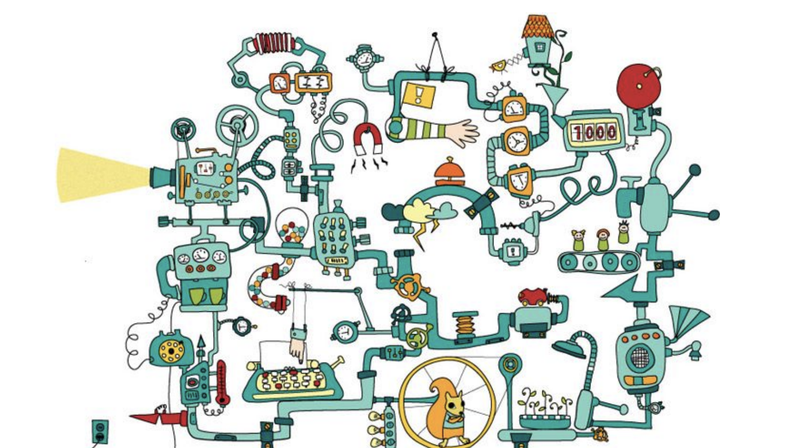
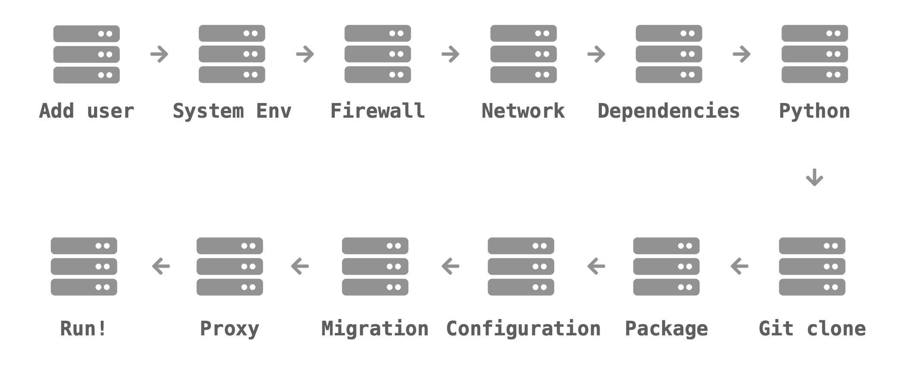
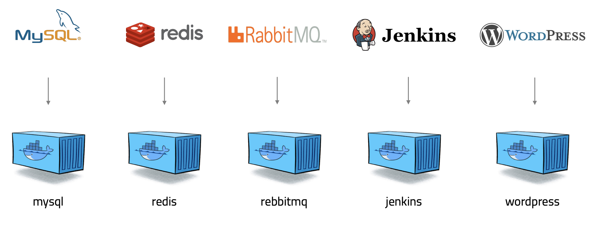
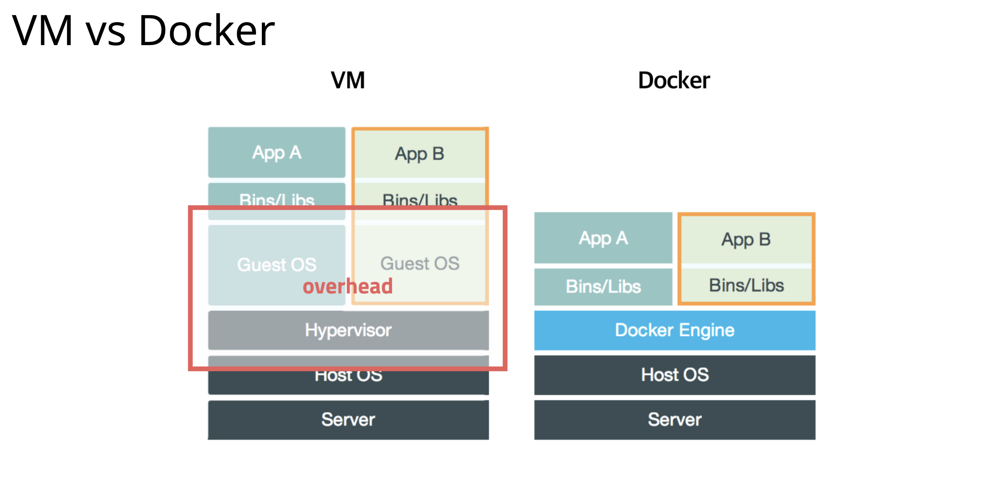

# 1. 도커란 무엇인가?

- 도커 : 컨테이너 기반의 오픈소스 가상화 플랫폼 입니다.
  - 다른 도구와 마찬가지로 **어떤 문제**를 해결하기 위해 만들어졌고 그 방법이 많은 사람들에게 인기를 끌면서 널리 사용되고 있습니다.

### 서버를 관리한다는 것은 무엇일까?

- 내부는 매우 복잡한 환경으로 구성되어 있습니다.
- 다양한 요구사항이 올 때... 항상 다양한 문제들이 생깁니다.
  - mySQL 좀 설치해주세요!
- 인프라가 자주 변경될 수 있다.
  - AWS를 써볼까?
  - NCP를 써볼까?
- 내부 개발팀에서 개발환경이 변경될 수 있다.
  - Node.js로 변경해볼까?
  - Ruby를 사용해볼까?
  - Spring이 최고지!

### 전통적인 서버관리의 방식

- 만약 중간에 어떤 부분이 업데이트가 발생하거나... version이 바뀌면??
- 또 수많은 단계에서 하나라도 문제가 생기면.. 다시해야한다..
- 즉 어디서 문제가 발생하면 모두가 무너질 수 있는... 

### 도커의 등장

- **도커가 등장하고 서버관리/개발 방식이 완전히 바뀌게 됩니다.**
- 어떠한 프로그램도 컨테이너로 만들 수 있습니다.
  - 즉 이말은 **어디서든 돌아갑니다!**
  - AWS, Azure, GoogleCloud, NCP 등

- 그럼 **가상머신**과 비슷한 것인가?
  - 반은 맞고 반은 틀린 말입니다!
    - 가상머신처럼 독립적으로 실행됩니다.
    - 가상머신보다 훨씬 빠릅니다.
    - 가상머신보다 매우 쉽고 매우 효율적입니다.
      - 일반적으로 가상머신은 CPU, 메모리가 더 느리다.

### 서버의 상태를 관리하기 위한 노력!

- 아주 정밀하게 문서를 작성한다. ( 설치하는 과정 등 )
  - 하지만.. 왜 똑같이 따라했는데 안되는데..
  - 이 문서 정확한 것인가?
  - 다른 OS에도 가능한가?
  - 버전이 바꼈는데.. 가능한가?
- 문서로는 부족하다! 상태관리 도구를 도입해보자
  - CHHEF, PUPPET 등 도구를 활용해 설정파일로 관리한다.
  - 하지만 런닝커브가 존재합니다.
  - 한 서버에 다른 버전 여러는 어떻게 설치하지?
    - 버전마다 설정과 경로를 다르게 해야한다.
- 그럼 가상머신에 만들어보자.
  - 근데 처음부터 다시 셋팅하려면 그것을 알아야 한다.
  - 용량도 너무 크고 공유도 어렵다.
  - 그리고 속도가 느리다..
- 자원 분리 ( 고급 기능 )
  - 프로레스를 가상으로 분리하자!
  - 파일과 디렉토리도 가상으로 분리하자!
  - CPU / MEMORY / I/0 성능도 그룹 별로 제한하자!
  - 리눅스 기능을 이용하기에 빠르고 효율적입니다.
  - 하지만 문제가 있다.
    - 사용하는게 너무 어렵습니다. 너무 고급기능!
- 드디어 **도커**의 등장!
  - 격리된 환경에서 작동하는 프로세스( 컨테이너 )를 공개!
  - 리눅스 커널의 여러 기술을 활용!
  - 하드웨어 가상화 기술보다 가벼움!
  - 이미지 단위로 프로세스 실행 환경을 구성!

### 도커에 대해 자세하게 알아보자!

- Guest OS + Hypervisor : 가상머신을 설치하게 되면 해당 층이 들어가게 되면서 속도가 저하됩니다.
- **도커는** 가상머신이 아니기 때문에 격리만 해주는 역할을 수행함으로 성능상 하락이 없습니다.

### 도커의 특징

- 확장성 / 이식성이 좋습니다.
  - 도커가 설치되어 있다면 어디서든 컨테이너를 실행할 수 있습니다.
  - 특정 회사나 서비스에 종속적이지 않습니다.
  - 쉽게 개발서버를 만들 수 있고 테스트 서를 생성하기에 편리합니다.
- 표준성
  - 도커를 사용하지 않는 경우 서비스 들의 배포방식이 제각각 다릅니다.
  - 컨테이너라는 표준으로 서버를 배포하므로 모든 서비스들의 배포과정이 동일합니다!
- 이미지
  - 이미지에서 컨테이너를 생성하기 때문에 반드시 이미지를 만드는 과정이 필요합니다.
  - Dockerfile을 이용하여 이미지를 만들고 처음부터 재현가능합니다.
  - 빌드 서버에서 이미지를 만들면 해당 이미지를 이미지 저장에 저장하고 운영서버에서 이미지를 불러옵니다.
- 설정 관리
  - 설정은 보통 환경변수로 제어합니다.
  - `MYSQP_PASS = password`와 같이 턴테이너를 띄울때 환경변수를 같이 지정할 수 있습니다.
  - 하나의 이미지가 환경변수에 따라 동적으로 설정파일을 생성할 수 있도록 만들어집니다.
- 자원관리
  - 컨테이너는 삭제 후 새로 만들면 모든 데이터가 초기화됩니다.
  - 업로드 파일을 외부 스토리지와 링크하여 사용하거나 S3같은 별도의 저장소가 필요합니다.
  - 세션이나 캐시를 memcached나 redis와 같은 외부로 분리해야 합니다.

### 도커가 가져온 변화!

- 클라우드 이미지보다 관리하기 쉽다!
- 다른 프로세스와 격리되어 가상머신처럼 사용하지만 성능저하가 거의 없습니다.
- 복잡한 기술을 몰라도 사용할 수 있습니다.
- 이미지 빌드 기록이 남습니다.
- 코드와 설정으로 관 => 재현 및 수정이 가능합니다.
- 오픈소스 => 특정 회사 기술에 종속적이지 않습니다.

### 도커의 미래? 컨테이너의 미래?

- **Kubernates**가 요즘 서버관리의 대세가 되고 있다.
  - **Kubernates**란 여러대의 서버와 여러대의 서비스를 관리기를 쉽게 해줍니다.
  - **Kubernates**안에 여러대의 **docker**가 존재하고 관리하기 쉽게 도와줍니다.
  - 스케줄링을 자동으로 해줍니다.
    - 컨테이너를 적당한 서버에 배포해주는 작업 ( 효율적 )
    - 여러 대의 서버 중 가장 할일이 없는 서버에 배포하거나 컨테이너의 개수가 늘어나게 되면 적당히 나눠서 배포해줍니다.
    - 서버가 죽으면 실행중이던 컨테이너를 다른 서버로 띄워주기도 합니다.
  - 클러스터링
    - 여러 개의 서버를 하나의 서버처럼 사용 가능합니다.
    - 작게는 몇 개 안되는 서버부터 많게는 수천 대의 서버 하나의 클러스터로 관리할 수 있습니다.
    - 여기저기 흩어져 있는 컨테이너도 가상 네트워크를 이용하여 같은 서버에 있는 것처럼 쉽게 통신할 수 있습니다.
  - 서비스 디스커버리
    - 서비스를 찾아주는 기능입니다.
    - 클러스터 환경에서 컨테이너는 어느 서버에 생성될지 알 수 없고 다른 서로 이동할 수 있습니다.
    - 따라서 컨테이너와 통신을 하기 위해서 어느 서버에서 실행중인지 알아야 하고 컨테이가 생성디고 중지될 때 어딘가에 IP와 Port같은 정보를 업데이트 해줘야 합니다.
    - 키-벨류 스토리지에 정보를 저장할 수도 있고 내부 DNS 서버를 이용합니다.
