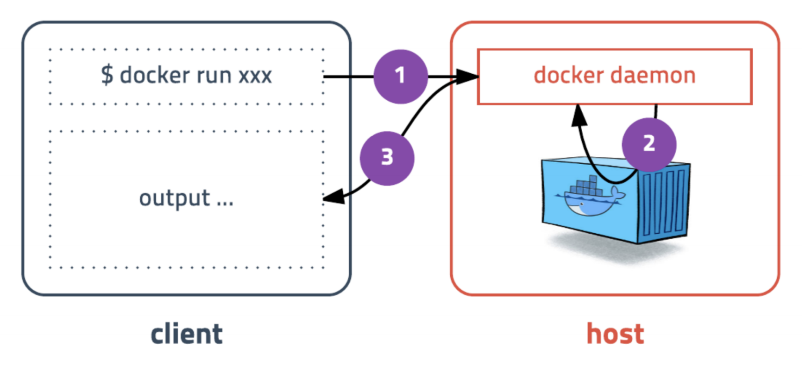

# 2. 도커 설치부터 실행까지


### 도커 설치하기

- 기본적으로 LINUX에서 돌아가는 프로그램입니다.
  - 자동으로 최신버전을 설치합니다.

```
curl -s https://get.docker.com/ | sudo sh
```

- ubuntu 유저 권한을 추가합니다.

```
sudo usermod -aG docker ubuntu
```


- MacOs or Windows

  - **Docker for Mac / Docker for Windows**를 홈페이지에서 설치합니다.
  - Docker는 가상머신에 설치 됩니다.
    - MacOS는 xhyve를 사용하고 Windows는 Hyper-V를 사용합니다.
    - 버전이 낮은 Windows 사용자는 VirtualBox로 설치해야 합니다.

- Mac 설치 방법

  - 클라이언트

    ```
    brew install Docker
    ```

  - 서버 : https://docs.docker.com/docker-for-mac/install/

- docker는 **client**와 **server**가 나눠져 있고 client에서 명령어를 치면 server로 전달합니다.




### 도커의 기본 명령어

- run - 컨테이너 실행
  - 먼저 image가 있는지 체크합니다.
  - image가 없으면 다운로드를 진행합니다.

```
docker run [OPTION] IMAGE[:TAG|@DIGEST] [COMMAND] [ARG...]
```

| -d        | detached mode (백그라운드 모드)                        |
| --------- | ------------------------------------------------------ |
| -p        | 호스트와 컨테이너의 포트를 연결                        |
| -v        | 호스트와 컨테이너의 디렉토리를 연결                    |
| -e        | 컨테이너 내에서 사용할 환경변수 설정                   |
| --name    | 컨테이너 이름 설정                                     |
| --rm      | 프로세스 종료시 컨테이너 자동 제거                     |
| -it       | -i와 -t를 동시에 사용한 것으로 터미널 입력을 위한 옵션 |
| --network | 네트워크 연결                                          |


### ubuntu 20.04 컨테이너 만들어보기

- image가 존재하지 않으면 알아서 다운로드를 진행하고 바로 서버는 생성하자마자 종료됩니다.
- 바로 종료되는 이유 : 컨테이너는 **프로세스** 이기 때문에 명령어를 안줘서 바로 종료가 되는 것입니다.

```
docker run ubuntu:20.04
```

- 명령어 추가
  - ununtu의 컨테이너를 실행해서 shell에 접속한 것입니다.
  - `-it` : 컨테이너 안에서 글자를 작성해서 컨테이너에 명령을 줄 수 있습니다.
  - `--rm` : `exit`로 컨테이너를 나갈 때에 컨테이너는 사라지지 않고 stop 상태로 되어있는데 이 옵션을 활용하면 바로 종료 될 때 삭제처리를 진행합니다.

```
docker run --rm -it ubuntu:20.04 /bin/sh
```


### CentOS 컨테이너 만들어보기

- 도커는 다양한 리눅스 배포판을 실행할 수 있습니다.
- 모두 동일한 커널을 사용하는게 공통점입니다!
- Alpine 이라는 초소용 (5MB)  이미지도 사용할 수 있습니다.

```
docker run --rm -it centos:8 /bin/sh
```


- 모두 속도가 너무 빠르다!!!


### 웹 어플리케이션 실행하기

- hashicorp/http-echo : 웹서버입니다.
- `-text` : 해당 text를 retrun 해줍니다.
- `-p 5678:5678` : 나의 PC의 5678 Port와 hashicorp 컨테이너의 5678 Port가 연결됩니다.

```
docker run --rm -p 5678:5678 hashicorp/http-echo -text="hello world"
```

- 내 PC의 Port로 한번 요청을 해봅시다!
  - `hello world`을 반환합니다.

```
curl localhost:5678
```

- 다중 서버**도 가능합니다.

```
docker run --rm -p 5679:5678 hashicorp/http-echo -text="hello world_2"
```


### Redis 실행해보기

```
docker run --rm -p 1234:6379 redis
```

- telnet으로 접근해보기!

```
telnet localhost 1234
```


### MySQL 실행해보기

- password를 입력하지 않겠다라고 환경변수로 설정!
- 그리고 가상의 이름을 부여해봅시다!
- `-d` : 백그라운드에서 실행되니 보이지 화면으로는 log가 보이지 않는다.

```
docker run -d -p 3306:3306 \
	-e MYSQL_ALLOW_EMPTY_PASSWORD=true \
	--name mysql \
	mysql:5.7
```

- mysql 접속하기
  - mysql이라는 이름을 가진 것을 실행하면서 동시에 mysql이라는 명령어를 실행할 것이다!
  - mysql client로 접속이 가능합니다.
  - `exec` : run 명령어와 달리 실행중인 도커 컨테이너에 접속할 때 사용하며 컨테이너 안에 ssh server등을 설치하지 않고 exec 명령어로 접속합니다. ( 보안상 권장 )

```
docker exec -it mysql mysql
```

- 도커는 다양한 데이터베이스를 손쉽게 생성/삭제할 수 있기 때문에 개발할때도 많이 사용합니다.

- 한번 워드프레스도 만들어 봅시다!

```
create database wp CHARACTER SET utf8;
grant all privileges on wp.* to wp@'%' identified by 'wp';
flush privileges;
quit
```

- 워드프레스 블로그를 실행해보자!

```
docker run -d -p 8080:80 \
	-e WORDPRESS_DB_HOST=host.docker.internal \
	-e WORDPRESS_DB_NAME=wp \
	-e WORDPRESS_DB_USER=wp \
	-e WORDPRESS_DB_PASSWORD=wp \
	wordpress
```

- `localhost:8080`으로 접속하시면 워드프로세스를 시작할 수 있고 블로그도 만들 수 있습니다1