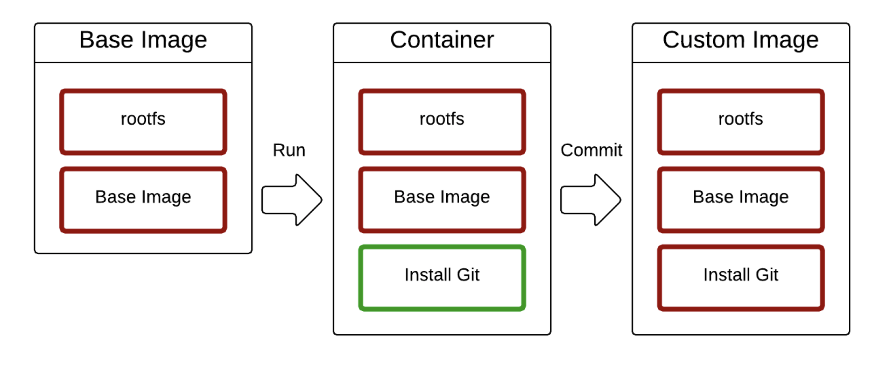

## 5. 도커 이미지 만들고 배포하기

- 지금까지는 누가 만들어 놓은 이미지를 가져와 컨테이너로 사용했었습니다.
- 지금은 이미지를 한번 직접 만들어 봅시다!


### 이미지란?

- 도커는 레이어드 파일 시스템 기반
- AUFS, BTRFS, Overlayfs .... 등 을 사용합니다.
- 이미지는 프로세스가 실행되는 파일들의 집합(환경)
- 프로세스는 환경(파일)을 변경할 수 있습니다.
- 이 환경을 저장해서 새로운 이미지를 만듭니다.


### 이미지의 특징

- 읽기 전용 과 쓰기 전용 2가지로 나뉩니다.
- Base Image : 읽기 전용
  - 수정할 수 없습니다.
  - 하지만 확장은 가능합니다.
- 예시 : 처음에 우분투를 실행을 하게 되면 우분투 컨테이너 안에는 Git이 존재하지 않습니다.
  - 내부에서 `npm i git`을 통해 설치 후 `commit`명령어를 사용하게 되면 Git이 포함된 새로운 이미지가 생성 됩니다.
  - **즉 새로운 상태를 이미지로 저장할 수 있습니다.**



- Git 설치해보기
  - git 이라는 컨테이너 생성 및  bash를 통해 접속

```
docker run -it --name git ubuntu:latest bash

// 설치
apt-get update
apt-get install -y git
git --version

// 이미지 커밋해보기 : git이라는 컨테이너를 ubuntu:git이라는 tag로 커밋한다는 의미
docker commit git ubuntu:git
```

- `docker images` 로 확인해보면 git이 포함된 ubuntu라는 **이미지가** 생성되있습니다!

```
// 생성한 이미지를 컨테이너로 동작해보기!
docker run -it --name git2 ubuntu:git bash

// git 사용 가능!
git --version
```


### 도커 이미지 이름의 규칙

- 도커 이미지를 만들 수 있는 명령어 입니다.


- 이미지 만들기 때 중요한 점
  - 한번에 성공하는 빌드는 없습니다.
  - 빌드가 성공될 때까지 많은 실패를 할 것입니다.
  - 일단 빌드를 성공한 후 리팩토링을 통해 더 최적화된 이미지를 생성하도록 노력해야 합니다.


### Dockerfile

- 이 명령어들을 조합해서 이미지를 만들게 됩니다.

| 명령어     | 설명                                                 |
| ---------- | ---------------------------------------------------- |
| FROM       | 기본 이미지                                          |
| RUN        | 쉘 명령어 실행                                       |
| CMD        | 컨테이너 기본 실행 명령어 (Entrypoint의 인자로 사용) |
| EXPOSE     | 오픈되는 포트 정보                                   |
| ENV        | 환경변수 설정                                        |
| ADD        | 파일 또는 디렉토리 추가. URL/ZIP 사용가능            |
| COPY       | 파일 또는 디렉토리 추가                              |
| ENTRYPOINT | 컨테이너 기본 실행 명령어                            |
| VOLUME     | 외부 마운트 포인트 생성                              |
| USER       | RUN, CMD, ENTRYPOINT를 실행하는 사용자               |
| WORKDIR    | 작업 디렉토리 설정                                   |
| ARGS       | 빌드타임 환경변수 설정                               |
| LABEL      | key - value 데이터                                   |
| ONBUILD    | 다른 빌드의 베이스로 사용될때 사용하는 명령어        |


### 이미지 빌드하기

- 현재 디렉토리의 Dockerfile로 빌드
  - -f <Dockerfile 위치> 옵션을 사용해 다른 위치의 Dockerfile 파일 사용 가능 합니다.
  - -t 명령어로 도커 이미지 이름을 지정
  - {네임스페이스}/{이미지이름}:{태그} 형식
- 마지막에는 빌드 컨텍스트 위치를 지정
  - 현재 디렉토리를 의미하는 점(.)을 주로 사용합니다.
  - 필요한 경우 다른 디렉토리를 지정할 수도 있습니다.

```
docker build -t {이미지명:이미지태그} {빌드 컨텍스트}

ex) docker build -t sample:1 .
```


### .dockerignore

- 도커 빌드 컨텍스트에서 지정된 패턴의 파일을 무시합니다.
- .git이나 민감한 정보를 제외하는 용도로 주로 사용합니다.
- .git이나 에셋 디렉토리만 제외시켜도 빌드 속도기 개선됩니다.
- 이미지 빌드 시에 사용하는 파일은 제외시키면 안됩니다!


### Git을 설치한 ubuntu 이미지를 직접 만들어봅시다.

- Dockerfile 생성 : 자동으로 할 수 있기 도와줍니다.
  - 장점 : 어떤 서버에 설치를 어떻게 했는지 그 히스토리를 알 수 있게 됩니다.

```
FROM ubuntu:latest
RUN apt-get update
RUN apt-get install -y git
```

- Dockerfile을 빌드합니다. ( 생성된 디렉토리에서 진행 )

```
docker build -t ubuntu:git-dockerfile .

// 이미지 확인
docker images

// 컨테이너 생성
docker run -it --name git3 ubuntu:git-dockerfile bash
```

