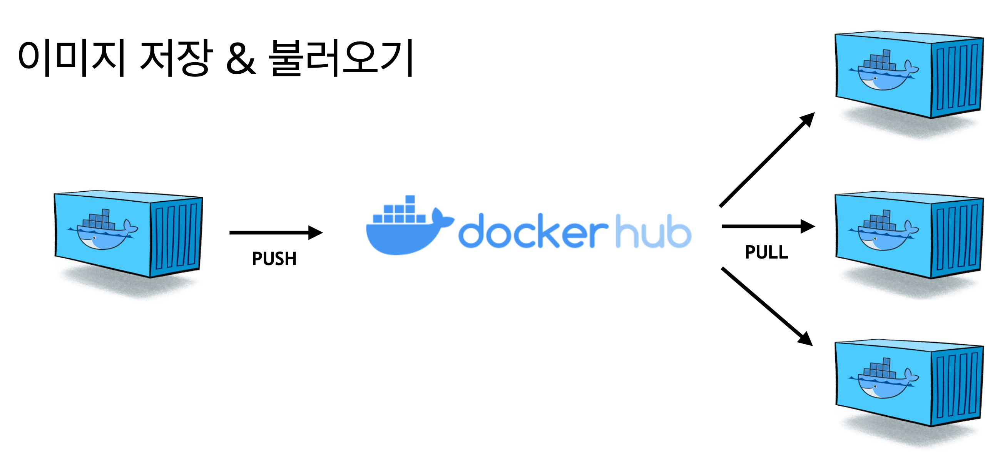

# 7. 이미지 저장소

- 만든 이미지를 다른 사람에게도 공유하기 위해 저장하는 방법을 알아봅시다.


### 이미지 저장 명령어

```
docker login // 이미지 저장소 로그인
docker push {ID}/example // 이미지 저장소에 내가 만든 이미지 올리기
docker pull {ID}/example // 이미지 저장소에 있는 이미지 가져오기
```

- **docker hub** : hub.docker.com
  - 무료를 사용하게 되면 다른사람도 받을 수가 있게 됩니다.
    - 한개만 비공개
  - 유료를 사용하게 되면 나만 주고 받을 수 있습니다.




### 배포하기

- **이미 도커 허브에 push하는 순간 배포가 된 것이다.**
- 컨테이너 실행 = 이미지 pull + 컨테이너 start

```
docker run -d -p 3000:3000 woodong/app
```

